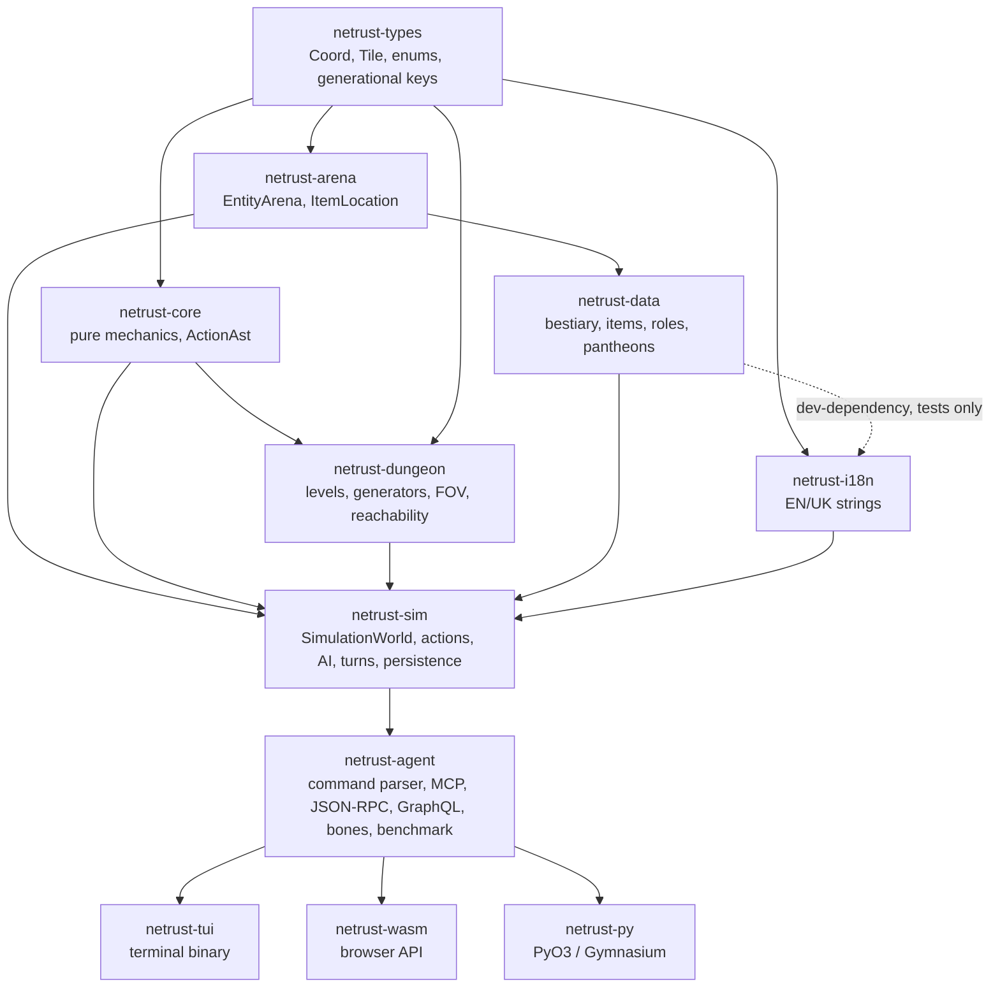
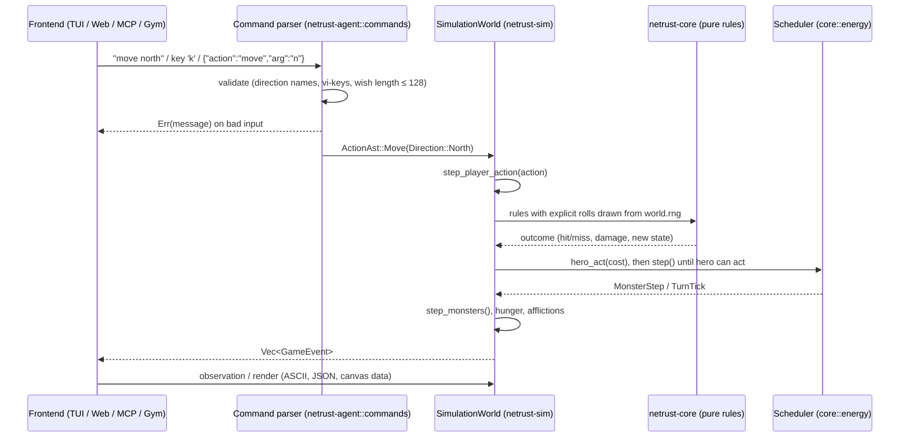

# NetRust Architecture: How It Is Built, and How It Differs from NetHack C

This article is for contributors and engineers reading the repository. It describes how the NetRust engine is put together today. It compares each part with the NetHack 5.0 C code it is modelled on, and it explains which choices aim to make the engine fast, reliable, compatible and fail-proof. It also lists where NetRust falls short of NetHack and where it is known to diverge from it.

All numbers were measured on a clean export of `main` (2026-10-04, Apple Silicon, Rust 1.88.0). References to NetHack C use paths inside the local `NetHack-5.0.0/` reference tree. That tree is git-ignored, so those paths are written as code, not links.

---

## 1. Summary

NetRust is a Rust reimplementation of a subset of NetHack. The game runs as a deterministic, serializable simulation library. Terminal, web, Python and network frontends all drive that library through one shared command parser.

The workspace has 11 crates with about 43,400 lines of Rust in 125 files. A separate Lean 4 project (`NetMechanics/`, 41 modules, 306 theorems, no `sorry`) holds simplified models of selected mechanics. 106 Rust property tests mirror those theorems and compare the engine with reference functions written from the C rules.

`cargo test --workspace --exclude netrust-py --locked` runs 591 tests, all passing. These two counts (591 tests, 306 theorems) are as of 2026-10-04 (after fidelity pass D2); later sections refer back to them. In a single-threaded release build, the benchmark plays 200 full games (about 41,700 game turns) in roughly 2.6 seconds.

The content covers about 12-15% of NetHack: 55 monster species against 394, 66 item kinds against about 452, and 9 roles against 13. Twenty-three divergences from C behaviour are documented in the mechanics spec.

---

## 2. The original: NetHack 5.0 C in brief

NetHack is a single-process C program that grew over decades. To understand NetRust you need to know about six of its traits.

| Aspect | NetHack 5.0 C |
|---|---|
| Size | `src/`: 130 `.c` files, 250,249 lines; `include/`: 30,966 lines. Whole tree incl. window ports, platforms, utilities: 306 `.c` files, 378,444 lines. `dat/`: 131 Lua level/dungeon scripts (17,223 lines). |
| Global state | ~46 global `struct instance_globals_*` objects (`include/decl.h`), accessed as `ga.`, `gb.`, ..., `svc.`, `svl.`, `svm.`; the hero is the global `struct you u` (`include/decl.h:99`); inventory is the global list `invent`. |
| Entities | Intrusive linked lists and raw pointers: `struct obj { struct obj *nobj; union vptrs v; ... }` (`include/obj.h`), where `vptrs` means "next object on this square", "my container" or "monster carrying me" depending on `obj->where`. Monsters chain through `struct monst *nmon`. The level map holds `objects[COLNO][ROWNO]` and `monsters[COLNO][ROWNO]` pointer grids (`include/rm.h`). |
| Main loop | `moveloop()` → `moveloop_core()` (`src/allmain.c`). The hero accumulates `u.umovement`; monsters move in a `do { movemon(); } while (...)` loop; per-monster speed comes from `mcalcmove()` (`src/mon.c:1126-1170`), which applies MSLOW/MFAST and **randomly rounds** movement to a multiple of 12. |
| Persistence | `savelev()` / `getlev()` (`src/save.c`, `src/restore.c`) write and read binary, struct-layout-dependent files and rebuild pointer chains on load. Bones files remap object IDs on load (`add_id_mapping`, `src/restore.c:254-258`). |
| RNG | `rn2()` / `rnd()` (`src/rnd.c`) over two streams (`CORE`, `DISP`), ISAAC64 when enabled, seeded from the OS per platform (`sys_random_seed()`), with optional reseeding. The RNG was not designed for replay. |
| Output | `struct window_procs` (`include/winprocs.h`) is a vtable of about 100 function pointers. Game code calls `pline()` and window procedures directly. Ports: `win/{tty,curses,Qt,X11,win32,...}`. |
| Levels | Special levels and the dungeon layout are Lua scripts (`dat/*.lua`, `dat/dungeon.lua`) run by an embedded Lua interpreter. |
| Build | Hand-written per-platform Makefiles and hints files (`sys/unix/Makefile.*`, `sys/unix/hints/`). |

This design is fast and battle-tested. It also has costs. State can be changed from anywhere. Pointer ownership is a matter of convention. Game logic and screen output are interleaved. Games cannot be replayed, and saves are tied to the platform. Those costs are what NetRust sets out to remove.

---

## 3. NetRust at a glance

### 3.1 Crate graph



| Crate | Lines | Role |
|---|---:|---|
| [netrust-types](../crates/netrust-types/src/lib.rs) | 965 | `Coord`, `Tile`, shared enums, generational keys `ItemId` / `ActorId` / `LevelId` |
| [netrust-arena](../crates/netrust-arena/src/lib.rs) | 322 | `EntityArena` (slot maps of items and actors), `ItemLocation` |
| [netrust-core](../crates/netrust-core/src/) | 8,218 | 38 modules of pure mechanics (combat, BUC, energy, enchantment, traps, religion, polymorph, ...) plus `ActionAst` |
| [netrust-dungeon](../crates/netrust-dungeon/src/) | 1,873 | `DungeonLevel`, generators, FOV, raycasting, reachability |
| [netrust-data](../crates/netrust-data/src/) | 2,510 | Static tables: `BESTIARY`, `ITEM_CATALOG`, `ROLES`, `RACES`, pantheons |
| [netrust-i18n](../crates/netrust-i18n/src/lib.rs) | 1,526 | English and Ukrainian strings, `t(key, locale)` |
| [netrust-sim](../crates/netrust-sim/src/) | 10,646 | `SimulationWorld`, action dispatch, monster AI, turn processing, level persistence, bones |
| [netrust-agent](../crates/netrust-agent/src/) | 5,502 | Shared command parser, sessions, MCP / JSON-RPC / GraphQL servers, bones server and client, benchmark arena, 6 binaries |
| [netrust-tui](../crates/netrust-tui/src/main.rs) | 1,712 | `netrust` terminal binary (crossterm) |
| [netrust-wasm](../crates/netrust-wasm/src/lib.rs) | 662 | `wasm-bindgen` API used by `web/index.html` |
| [netrust-py](../crates/netrust-py/src/lib.rs) | 707 | PyO3 extension used by the Gymnasium environment |

### 3.2 Layering rules

- **Dependencies point one way:** types → arena/core → dungeon/data → i18n → sim → agent → frontends. `netrust-i18n` uses `netrust-data` only as a dev-dependency, for its name-coverage tests. No crate depends on a crate above it.
- The graph shows only the main edges. The frontends (`netrust-tui`, `netrust-wasm`, `netrust-py`) also depend directly on lower crates such as `netrust-sim`, `netrust-core` and `netrust-types`.
- **`netrust-core` has no I/O and no RNG.** Its only dependencies are `netrust-types` and `serde` ([Cargo.toml](../crates/netrust-core/Cargo.toml)). Every random outcome reaches it as an explicit argument.
- **Engine crates do no I/O.** A grep for `std::fs`, `std::io` or `File::` in the `src/` of core, sim, dungeon, data, arena and types finds nothing. Files, sockets, terminals and the browser are handled only by the frontends.

### 3.3 One turn, end to end



[`SimulationWorld::step_player_action(&mut self, ActionAst) -> Vec<GameEvent>`](../crates/netrust-sim/src/actions/mod.rs) is the only entry point for gameplay. It `match`es on the action and hands off to domain handlers in [`actions/`](../crates/netrust-sim/src/actions/) (movement, doors, inventory, items, economy, engrave, ranged, religion, stairs). [`process_turn_ticks`](../crates/netrust-sim/src/turns.rs) then runs the scheduler until the hero can act again. If the player is dead or missing, the call does nothing and returns an empty event list.

### 3.4 Where to start reading the code

Open these files in this order:

1. [netrust-core/src/ast.rs](../crates/netrust-core/src/ast.rs): the list of actions a player can take.
2. [netrust-sim/src/world.rs](../crates/netrust-sim/src/world.rs): everything a game contains.
3. [netrust-sim/src/actions/mod.rs](../crates/netrust-sim/src/actions/mod.rs): how one action is dispatched.
4. [netrust-sim/src/turns.rs](../crates/netrust-sim/src/turns.rs) and [netrust-core/src/energy.rs](../crates/netrust-core/src/energy.rs): how turns and monster moves are scheduled.
5. [netrust-arena/src/lib.rs](../crates/netrust-arena/src/lib.rs): how items and actors are stored.
6. [netrust-agent/src/commands.rs](../crates/netrust-agent/src/commands.rs): how text and keys become actions.

For a working example of the whole loop, read [simulation_tests.rs](../crates/netrust-sim/tests/simulation_tests.rs).

---

## 4. Core design decisions

Each subsection follows the same pattern: what C does, what NetRust does, and why.

### 4.1 Entity storage: generational arenas instead of pointer chains

- **C:** Objects and monsters live in intrusive singly linked lists. `union vptrs` reuses one pointer slot for three different relationships, and `obj->where` says which one applies.
- **Rust:** [`EntityArena`](../crates/netrust-arena/src/lib.rs) holds `items: SlotMap<ItemId, ItemRecord>` and `actors: SlotMap<ActorId, ActorRecord>`. An item's position is a tagged enum:

  ```rust
  pub enum ItemLocation { Floor(Coord), InContainer(ItemId), CarriedBy(ActorId), Limbo }
  ```

  The hero and the monsters share one `ActorRecord` type, marked by `is_player`. C uses separate types, `struct you` and `struct monst`.
- **Why:** A generational key can't dangle silently. Looking up a removed entity returns `None` instead of reading freed memory, and the compiler forces every `ItemLocation` case to be handled. The arena also checks containment: `contains_transitive` rejects container cycles, and the recursive weight calculation applies the Bag of Holding halving (`div_ceil(2)`).

### 4.2 One serializable world instead of globals

- **C:** About 46 global structs plus `u`, `invent` and the level arrays.
- **Rust:** [`SimulationWorld`](../crates/netrust-sim/src/world.rs) is one struct. It holds the current `DungeonLevel`, the stored levels, the arena, the scheduler, hero state, divine and quest state, the RNG, the seed, the event log, the genocide registry and conducts. It derives `Clone, Serialize, Deserialize`.
- **Why:** The whole game is one value. It can be cloned for search or rollouts, serialized to JSON, compared in tests, and run in parallel with other worlds in one process with no shared mutable state.

### 4.3 Action AST and event stream instead of direct output

- **C:** `rhack()` handles a keystroke inside `moveloop_core`. Game code prints with `pline()` and calls window procedures as it goes.
- **Rust:** Input is an [`ActionAst`](../crates/netrust-core/src/ast.rs) (34 serializable variants: `Move`, `MeleeAttack`, `PickUp`, `Quaff`, `Read`, `ZapWand`, `Pray`, `Cast`, `Wish`, `Fire`, `Mount`, `Untrap`, ...). Output is a list of [`GameEvent`](../crates/netrust-sim/src/events.rs) values (14 variants: `ActorMoved`, `AttackLanded`, `AttackMissed`, `BeamPropagated`, `DoorToggled`, `ItemPickedUp`, `TurnAdvanced`, `LevelChanged`, `Victory`, `LogMessage`, ...).
- **Why:** The engine never knows how it is being displayed. A terminal, a browser canvas, a JSON-RPC client and a reinforcement-learning agent all consume the same events. Because actions and events are plain data, they can be logged, replayed and compared.

### 4.4 Mechanics as pure functions with explicit rolls

- **C:** Formulas call `rn2()` and `rnd()` inline and read globals such as `u.uluck`.
- **Rust:** `netrust-core` functions take each die roll as an argument. In [combat.rs](../crates/netrust-core/src/combat.rs), for example:
  - `attack_hits(d20, to_hit)` clamps `d20` to `1..=20`.
  - `monster_to_hit_value(m_level, hero_ac, ac_roll)` takes the `rnd(-ac)` draw as a parameter.
  - `melee_damage` is never less than 1.
  - Luck is clamped to `-13..=13`.

  Rolls outside their range are clamped and never cause a panic. Doc comments cite the C source they follow, for example `uhitm.c:365` and `mhitu.c:709`.
- **Why:** A pure function can be property-tested over its whole input range, modelled in Lean, and reasoned about without any game state. The simulation decides *when* to draw a number and the core decides *what the number means*. Keeping those apart is what makes "draw only when C draws" fidelity work possible (see §7).

### 4.5 Deterministic RNG with saved state

- **C:** ISAAC64, seeded from the OS, with a separate display stream and optional reseeding.
- **Rust:** One `ChaCha8Rng`, created with `seed_from_u64(seed)` and stored inside `SimulationWorld`. `rand_chacha` is built with its `serde` feature, so **the stream position is saved with the game**. Dungeon generators are generic over `R: Rng` ([generator.rs](../crates/netrust-dungeon/src/generator.rs)).
- **Why:** The same seed and the same action sequence produce the same events. `test_deterministic_replay` in [simulation_tests.rs](../crates/netrust-sim/tests/simulation_tests.rs) checks this. `world_roundtrip_preserves_rng_traps_and_engravings` in [save_load_tests.rs](../crates/netrust-sim/tests/save_load_tests.rs) checks that the next random number after a JSON round trip matches the next number from the original world.

### 4.6 Level persistence with ID remapping

- **C:** `savelev()` writes the level to a binary file and `getlev()` rebuilds the pointer chains. Bones loading remaps object IDs.
- **Rust:** On every level change, [`pack_current_level`](../crates/netrust-sim/src/actions/stairs.rs) moves the level's monsters, floor items, items those monsters carry, and items inside containers (found transitively and cycle-safely) out of the arena and into a `StoredLevel`. It also clears stale wield and quiver references and splits off the unpaid-items ledger. `unpack_or_generate_level` respawns the entities under fresh slot-map keys. It builds old→new `actor_map` and `item_map` tables, rewrites `InContainer` and `CarriedBy` locations, and drops any dangling reference on the up stairs instead of failing.
- **Why:** This is the same idea as C's bones `add_id_mapping`, applied to every level change. Keys never need to stay stable across levels, so the arena holds only live entities. [level_persistence_tests.rs](../crates/netrust-sim/tests/level_persistence_tests.rs) has 9 tests for this, including nested floor containers and monster inventories surviving a round trip.

### 4.7 Data tables

- **C:** Large macro tables: `include/monsters.h` (394 `MON(` entries), `include/objects.h`, `include/artilist.h`.
- **Rust:** `static` slices in [netrust-data](../crates/netrust-data/src/): `BESTIARY` (47 `MonsterArchetype`s), `ITEM_CATALOG` (66 `ItemArchetype`s), `ROLES` (9), `RACES` (5) and pantheons. They are keyed by closed enums (`MonsterSpeciesId`, `ItemKindId`). Lookups use `.iter().find()` with an `expect`, and unit tests spawn every enum variant, so a missing table row fails a test rather than a game.
- **Why:** The tables are declarative, type-checked and exhaustive. Adding content still requires recompiling (see §9). Since fidelity pass D2, every entry carries its C values and attack list (`Attack { at, ad, n, d }`), and invented entries such as "war dog" were replaced by C ones ("large dog").

### 4.8 Dungeon generation with reachability guarantees

- **C:** Random rooms and corridors from `mklev.c`, and special levels from Lua scripts.
- **Rust:** [`DungeonLevel`](../crates/netrust-dungeon/src/level.rs) is an 80×21 tile grid with rooms, stairs, and sparse `HashMap`s of engravings and traps. Generators exist for regular levels, Sokoban, the Gnomish Mines and Minetown, Quest home/locate/goal, Gehennom mazes, the Valley, Moloch's Sanctum, the Castle and the Astral Plane. All layouts are hard-coded in Rust; there is no level-description language. [reach.rs](../crates/netrust-dungeon/src/reach.rs) provides `reachable_from`, `reachable_from_with` and `find_free_floor`.
- **Why:** [tests/reachability.rs](../crates/netrust-dungeon/tests/reachability.rs) sweeps 200 seeds per generator family. It checks that stairs connect and that key targets can be reached: the Sokoban prize after the pits are filled, Minetown shops and temple, the Mines, the Quest, Gehennom and the Sanctum altar. A generator change that strands the player fails CI.

---

## 5. Performance

### 5.1 Measurements

These numbers were measured on 2026-10-04 on an Apple Silicon Mac, using a clean export of `main` and Rust 1.88.0. To reproduce the benchmark (it writes `web/benchmark_report.json` relative to the current directory):

```bash
cargo run --release -p netrust-agent --bin netrust-benchmark
```

NetRust has not been benchmarked against NetHack C.

| Measurement | Result |
|---|---|
| `netrust-benchmark` (release, single thread): seeds 1-25 × {Valkyrie, Wizard} × 4 policies, max 1000 turns = 200 games | **2.56 s** wall (2.29 s user), ≈ 41.7k game turns, **≈ 16k turns/s** including writing a 68 KB JSON report |
| Full test suite (debug, §1) | 3.44 s total test execution; ≈ 41 s wall for `cargo test` including compilation with dependencies already built |
| Slowest test groups | 200-seed reachability sweeps 1.38 s; one 7-test unit suite 1.50 s |
| Release build of `netrust-benchmark` (dependencies already built) | 24.9 s |
| WASM, raw `cargo build --release --target wasm32-unknown-unknown` | 1.2 MB |
| WASM, `wasm-pack` output (`netrust_wasm_bg.wasm`) | 550 KB + 22 KB JS glue |

The benchmark's AI policies are weak: the mean depth reached is 1.0-2.8 and no policy wins. The turns-per-second figure measures the engine, not the quality of play.

### 5.2 Design choices that help performance

- **No I/O in the engine.** Stepping touches only memory. Rendering, file writes and network traffic happen outside `step_player_action`.
- **Compact storage.** Slot maps give O(1) insert, remove and lookup in contiguous storage. Traps and engravings use sparse `HashMap<Coord, _>`. Breadth-first searches use `HashSet`s.
- **No global locks or ambient state in the engine.** A `SimulationWorld` is a plain value, so many worlds can run side by side in one process. This is what the batch arena and the Python Gymnasium environment rely on.
- **Deterministic stepping.** Same seed and same actions give the same result, so a benchmark or training rollout can be reproduced exactly without saving any trace beyond the seed and the action list.

### 5.3 Performance caveats

- Floor, carried and container queries (`items_at_floor`, `items_carried_by`, `items_in_container`) are **linear scans over all items** in the arena.
- Data-table lookups are linear `.iter().find()` calls. `stored_levels` is a `Vec` searched with `.position()`.
- Monster AI computes a `DijkstraField` from the player's position once per monster step.
- Every monster shares one energy pool (§7.3), which costs less than per-monster speed but is less faithful.
- The benchmark is sequential, and **no release profile has been tuned**: there is no `[profile.*]` section, no LTO and no codegen-units setting.

None of these has been a bottleneck at the current content size. They are the first places to look if they become one.

---

## 6. Reliability and failure handling

### 6.1 Language-level guarantees

- **No `unsafe`** anywhere in `crates/`. This is a fact about the current code; no `#![forbid(unsafe_code)]` attribute enforces it.
- **Inputs are validated where they enter the system.**
  - [`Coord`](../crates/netrust-types/src/lib.rs) deserializes through `#[serde(try_from = "RawCoord")]`. An out-of-bounds coordinate in JSON is rejected with "coordinate (x, y) out of bounds 80x21", and `Coord::new` returns `Option`.
  - The shared parser rejects unknown directions and wish text over 128 characters.
- **Arithmetic saturates or clamps.** The scheduler uses `saturating_sub`, the to-hit formula chains `saturating_add`, and roll parameters are clamped. Integrity tests such as `damage_player_saturates_and_marks_death` and `arrow_trap_at_one_hp_kills_without_wrapping` ([integrity_tests.rs](../crates/netrust-sim/tests/integrity_tests.rs)) cover this.
- **Panic hooks.**
  - The TUI installs a hook that restores the terminal before a panic message prints: raw mode off, cursor shown, alternate screen left.
  - The WASM build installs `console_error_panic_hook`, so panics appear in the browser console.

### 6.2 Protocol and server hardening

- **JSON-RPC 2.0 and MCP** ([rpc.rs](../crates/netrust-agent/src/rpc.rs), [jsonrpc.rs](../crates/netrust-agent/src/jsonrpc.rs), [mcp.rs](../crates/netrust-agent/src/mcp.rs)) use the standard error codes -32700, -32600, -32601 and -32602. Handlers return `Err((code, msg))` rather than panicking. The stdio line reader ([stdio.rs](../crates/netrust-agent/src/stdio.rs)) reports invalid UTF-8 as an error instead of aborting. [protocol_tests.rs](../crates/netrust-agent/tests/protocol_tests.rs) has 17 tests for this.
- **GraphQL** ([graphql.rs](../crates/netrust-agent/src/graphql.rs)) caps request bodies at 64 KiB and limits query depth to 16 and complexity to 2000.
- **Bones server** ([bones/server.rs](../crates/netrust-agent/src/bones/server.rs)) has these limits:
  - 64 KiB body limit
  - hero names of 1-32 characters, killer text of at most 64 characters
  - at most 64 items per bones entry, depth from 1 to 60
  - at most 16 bones per depth and 1000 graves

  Its mutex is poison-tolerant (`unwrap_or_else(PoisonError::into_inner)`). [bones_hardening_test.rs](../crates/netrust-agent/tests/bones_hardening_test.rs) covers these limits.
- **Network exposure.** The network servers bind to `127.0.0.1` by default. `--bind` or an environment variable overrides this, and an optional bearer token comes from `NETRUST_TOKEN` ([netconfig.rs](../crates/netrust-agent/src/netconfig.rs)).

### 6.3 CI gates and reproducible tooling

CI ([.github/workflows/lean_action_ci.yml](../.github/workflows/lean_action_ci.yml)) runs six jobs on every push and pull request:

| Job | Command |
|---|---|
| `verify-lean` | `leanprover/lean-action` builds `NetMechanics` |
| `fmt` | `cargo fmt --all --check` |
| `clippy` | `cargo clippy --workspace --all-targets --locked -- -D warnings` |
| `test` | `cargo test --workspace --exclude netrust-py --locked` |
| `wasm` | `cargo build -p netrust-wasm --target wasm32-unknown-unknown --locked` |
| `docs` | `bash scripts/check-doc-links.sh` |

The toolchain is pinned to Rust 1.88.0 in [rust-toolchain.toml](../rust-toolchain.toml), and CI installs the same version. `Cargo.lock` is committed and every command passes `--locked`. `async-graphql` is pinned to an exact version (`=7.0.2`). `netrust-py` is left out of the CI test run because it needs a Python to link against.

### 6.4 Testing in layers

1. **Unit and integration tests:** the 591 tests from §1. The largest groups are 131 sim unit tests, 101 in `simulation_tests.rs`, and 97 property tests.
2. **Seed sweeps:** 200 seeds per dungeon generator family (§4.8).
3. **Property tests against reference models:** [proptest_mechanics.rs](../crates/netrust-core/tests/proptest_mechanics.rs) (2,311 lines, 106 `prop_*` tests). Each test corresponds to a theorem in `NetMechanics`. Fidelity pass D1 added a rule: these tests compare the Rust code with an *independent* reference written from the C rule, rather than with a copy of the Rust implementation.
4. **Lean 4 models:** [NetMechanics/](../NetMechanics/) has 41 modules and the 306 theorems from §1. It contains no `sorry`, `admit` or `native_decide` and declares no axioms of its own; the policy is in [lean4-verification-guide.md](lean4-verification-guide.md).

What this does and doesn't establish: the Lean models are **simplified abstractions of selected mechanics**, and their theorems are machine-checked. The Rust code is *tested* against the same properties with proptests. There is **no formal link** between the Lean models and the Rust code, so NetRust is not formally verified. The Lean guide and the mechanics spec both say the models are not a faithful transcription of NetHack 5.0.

### 6.5 Known weak spots

- The non-test source still has about 121 `.unwrap()`, 9 `.expect(` and 7 `panic!` calls. This count includes inline `#[cfg(test)]` modules, so it is an upper bound. One example in the hot path: `Search` does `self.arena.actors.get(self.player_id).unwrap()`.
- GraphQL resolvers use `state.session.lock().unwrap()`. A panic while the lock is held poisons it for every later request, unlike the bones server's poison-tolerant lock.
- The stdio servers' line reader has **no maximum line length**.
- The bearer-token check uses plain `==`, not a constant-time comparison.
- The tree uses two major versions of `rand`: 0.8 with `rand_chacha` 0.3 in `netrust-agent`, and 0.9 in sim and dungeon.

---

## 7. Compatibility with NetHack (fidelity)

### 7.1 Fidelity policy and the D1 pass

NetRust brings its mechanics in line with NetHack 5.0 in numbered *fidelity passes*. Each changed function cites the C code it follows as `file.c:line`, and each pass updates the Lean models and proptests along with it. Pass **D1** is merged to `main`. It aligned 16 areas with C: hero to-hit, damage and AC absorption, floor traps, luckstone timeout, hunger, encumbrance, enchantment, wand recharging, shop prices, Bag of Holding explosions, polymorph overkill, bones cursing, the Mysterious Force, priest protection, quest leaders and nemeses, and stronger Lean theorems. It also set starting weapon skills to follow `skill_init` (`weapon.c:1752`). The full table with C line references is in the [D1 design](superpowers/specs/2026-10-04-fidelity-d1-design.md) and [C reference](superpowers/specs/2026-10-04-fidelity-d1-c-reference.md).

Pass **D2** is also merged. It replaced monster, item and pantheon table values with C values and made the simulation use them: monster attack lists resolved in C order with their own to-hit and dice, hero weapon damage via `dmgval`, hero AC via `find_ac` from worn armor, and peaceful monsters via `peace_minded`, `setmangry` and the Elbereth `onscary` exemptions. Details: [D2 design](superpowers/specs/2026-10-04-fidelity-d2-design.md).

### 7.2 Known divergences

The [formal mechanics spec](formal-mechanics-spec.md#known-divergences-from-nethack-c) lists 23 divergences that remain. They fall into five groups: combat (simplified attack side effects, the missing `abon()`, `dmgval` extras), economy and religion (priest donations, shop pricing, the cheapskate counter), the Mysterious Force in Gehennom, items and data (Bag of Holding scatter, name-based kind and species lookup, catalog simplifications), and the character and monsters (starting inventories and alignment record, untracked attributes, fainting, peacefulness rules not yet ported, old saves loading monsters hostile). The spec states that its formulas should not be treated as authoritative descriptions of NetHack C behaviour.

### 7.3 Structural simplifications

- **Monster speed.** Every monster draws from one shared energy pool ([energy.rs](../crates/netrust-core/src/energy.rs)). There is no per-monster `mcalcmove`, so no MSLOW/MFAST and no random rounding. As of 2026-10-04, per-monster speed is planned for D3.
- **RNG streams.** NetRust does not try to reproduce C's random number stream: it uses ChaCha8 where C uses ISAAC64. Fidelity is at the level of formulas and distributions, and the code aims to draw a random number only where C draws one (for example `rn2(343)` for wand recharging).

### 7.4 Determinism, replay and save compatibility

- **Replay.** A recorded game consists of its seed and its `ActionAst` sequence, and replaying that sequence reproduces the same events (§4.5). C NetHack does not support seeded replay by design: it seeds from the OS, can reseed, and uses a separate display stream.
- **Saves** are JSON produced by `serde_json`. `HashMap<Coord, _>` fields go through a `coord_map` adapter. The C save format is binary and depends on struct layout.
  - **Back-compatibility:** new fields get `#[serde(default)]`. Examples on `SimulationWorld` include `priest_cheapskate`, `quest_state`, `mysterious_force_count`, `genocide_registry`, `conducts` and the RNG itself; others are `ItemRecord.recharged` and `DungeonLevel.traps` / `is_dark`. The test `mysterious_force_count_serde_default` deletes a field from saved JSON and reloads it. The D2 design (as of 2026-10-04) adopts this as a rule.
  - **Limitation:** the TUI has no save or restore command. Serialization is used through tests and the API.

### 7.5 One parser for every frontend

[commands.rs](../crates/netrust-agent/src/commands.rs) is the single place where text and keys become `ActionAst`. It accepts direction names and vi-keys and enforces the wish-length limit. MCP, JSON-RPC, GraphQL and WASM all use it, so the same command means the same thing in every frontend.

---

## 8. Frontends and integrations

| Frontend | Location | Notes |
|---|---|---|
| Terminal (`netrust`) | [netrust-tui](../crates/netrust-tui/src/main.rs) | crossterm; pure key handler in [keys.rs](../crates/netrust-tui/src/keys.rs); `--seed N`; panic hook restores the terminal |
| Web | [netrust-wasm](../crates/netrust-wasm/src/lib.rs) + [web/index.html](../web/index.html) | `wasm-bindgen` API for stepping, rendering and observations; built with `wasm-pack` (see the README) |
| Python / Gymnasium | [netrust-py](../crates/netrust-py/src/lib.rs), [python/netrust_gym/env.py](../python/netrust_gym/env.py) | PyO3 environment with action masking; REINFORCE example in [train_reinforce.py](../python/train_reinforce.py) |
| MCP (stdio) | [mcp.rs](../crates/netrust-agent/src/mcp.rs) | Tools for observing, stepping and resetting a game |
| JSON-RPC 2.0 (stdio) | [jsonrpc.rs](../crates/netrust-agent/src/jsonrpc.rs) | Standard error codes |
| GraphQL (HTTP) | [graphql.rs](../crates/netrust-agent/src/graphql.rs) | axum + async-graphql; game state, data tables and step mutations |
| Bones server | [bones/](../crates/netrust-agent/src/bones/) | Shares bones between players over HTTP; limits in §6.2 |
| Benchmark / demo | [benchmark.rs](../crates/netrust-agent/src/bin/benchmark.rs), [arena.rs](../crates/netrust-agent/src/arena.rs) | Fixed tournament of 4 policies (§5.1) |

The tool, query and mutation names are listed in [agent-and-mcp-integration.md](agent-and-mcp-integration.md).

Strings come from [netrust-i18n](../crates/netrust-i18n/src/lib.rs): 126 keys, English and Ukrainian, compiled in as `match` tables, with coverage tests. Monster and item names are translated too.

C supports display back ends through one `window_procs` vtable. NetRust has a separate crate for each frontend, all talking to the same simulation API.

---

## 9. Limitations and roadmap

### 9.1 Scope compared with NetHack 5.0

| | NetHack 5.0 C | NetRust (`main`) |
|---|---:|---:|
| Monster species | 394 | 47 (≈12%) |
| Object kinds | ≈452 | 66 (≈15%) |
| Roles / races | 13 / 5 | 9 / 5 |
| Spells | ≈40 spellbooks | 4 (`ForceBolt`, `MagicMissile`, `CureLightWounds`, `ExtraHealing`) |
| Artifacts | 35 | `ArtifactKind` enum, partial |
| Special-level engine | Lua (131 scripts) | Hard-coded Rust generators |
| Languages | English | English, Ukrainian |

**Systems that are missing or simplified on `main`:**

- **Character:** no Str/Dex/Con/Int/Wis/Cha attributes and no `abon()`; no XP or level-up.
- **Monsters:**
  - Shared monster energy pool instead of per-monster speed.
  - Pets don't follow the hero to other levels.
- **Movement:** encumbrance doesn't slow movement.
- **Dungeon:** the Wizard's Tower, Vlad's Tower and Fort Ludios are stubs (solid stone with one staircase).
- **Configuration and saves:** no options or config file, and no save game in the TUI.

### 9.2 Next fidelity passes (as of 2026-10-04)

- **D2** (merged): C values for the monster, item and pantheon tables, attack lists, weapon dice, armor AC, and peaceful monsters.
- **D3** (planned): per-role starting alignment record with kill-based alignment, floating-eye paralysis, per-monster speed, XP and level-up, pets following the hero across levels, encumbrance applied to movement, and telepathy while blind.
- **Later:** the remaining divergences in §7.2.

### 9.3 Configurability (planned)

Rule packs are designed (umbrella design on the `feat/rule-packs-p1` branch): data-only packs of TOML files that change monster, item and role data on top of vanilla, built by a `netrust-pack` tool into a hashed `.nrpack` that every frontend can load, with typed mechanics knobs, a web editor and RL integration in later phases. Phase P1 (the engine reads a `Ruleset` instead of static tables, plus the pack format and CLI) is in progress.

As of today, all content and rules are compiled-in Rust statics and `match` arms, keyed by closed enums. The only runtime configuration is the seed, the locale and a `CharacterConfig`. Two features of the current code are natural places to attach such tools: the roll-parameterized pure functions in `netrust-core`, and the serializable boundary from `ActionAst` to `GameEvent`.

---

## 10. Glossary and further reading

| Term | Meaning |
|---|---|
| **Arena** | `EntityArena`: slot maps that own every item and actor; entities refer to each other by generational keys. |
| **Generational key** | `ItemId` / `ActorId` / `LevelId`: an index plus a version number, so a stale key fails to resolve instead of pointing at a reused slot. |
| **`ItemLocation`** | Tagged enum giving an item's position: floor, container, carrier or limbo. It replaces C's `union vptrs` and `obj->where`. |
| **`ActionAst`** | A serializable player action; the only input to the simulation. |
| **`GameEvent`** | A serializable observable outcome; the only output of a step. |
| **Explicit roll** | A random value passed into a pure core function as an argument instead of being drawn inside it. |
| **Fidelity pass (D1, D2, D3)** | A numbered batch of changes that aligns mechanics with NetHack 5.0 C, with C line citations, Lean updates and proptests. |
| **Seed sweep** | A test that runs a generator over many seeds (200 here) and checks invariants such as reachability. |
| **Bones** | The level a dead character leaves behind for later games; NetRust can share bones through the bones server. |

**Further reading in this repository:**

- [c-to-rust-migration-architecture.md](c-to-rust-migration-architecture.md): the original migration blueprint.
- [formal-mechanics-spec.md](formal-mechanics-spec.md): mechanics formulas, C cross-references and known divergences.
- [lean4-verification-guide.md](lean4-verification-guide.md): the Lean theorem catalog and how it maps to proptests.
- [ontology-and-taxonomy.md](ontology-and-taxonomy.md): domain ontology and taxonomies.
- [agent-and-mcp-integration.md](agent-and-mcp-integration.md): MCP, JSON-RPC and GraphQL usage.
- [master-roadmap-to-nethack-parity.md](master-roadmap-to-nethack-parity.md): the roadmap toward NetHack parity.
- [superpowers/specs/](superpowers/specs/): design specs, including the D1 fidelity pass and the hardening work.
