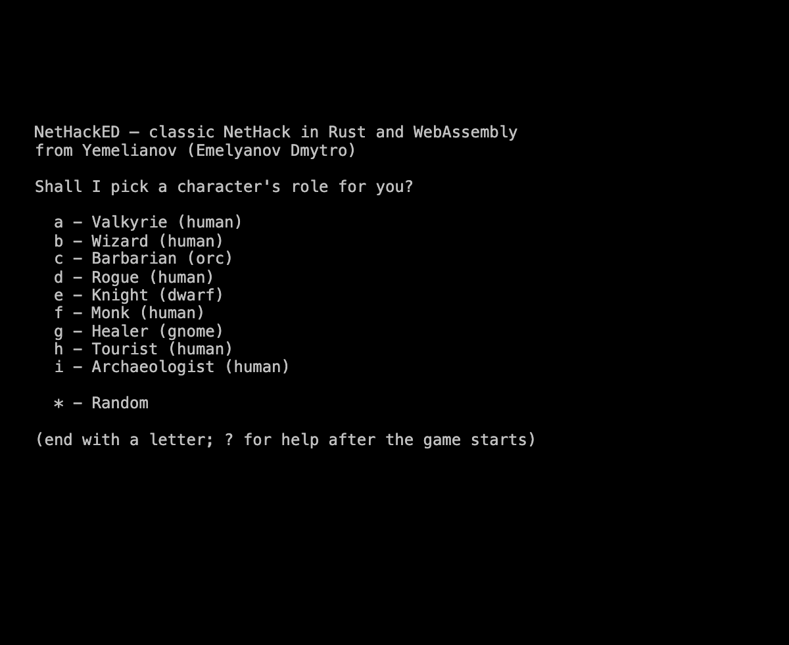
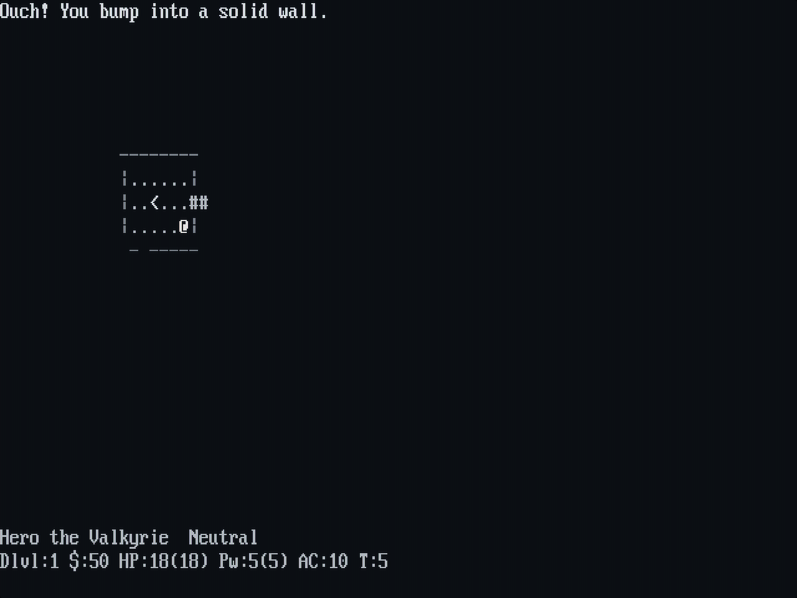
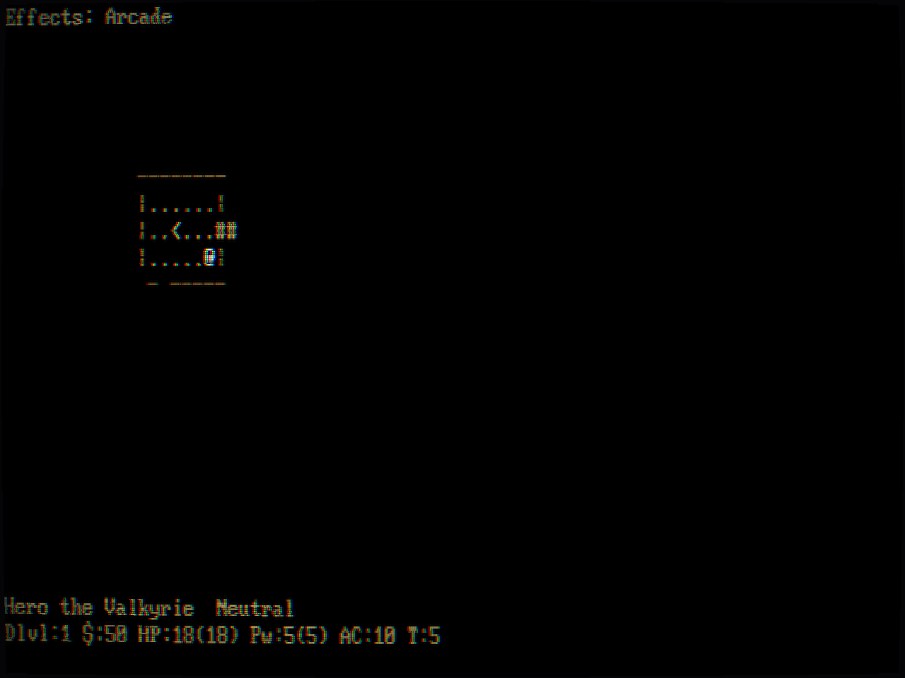
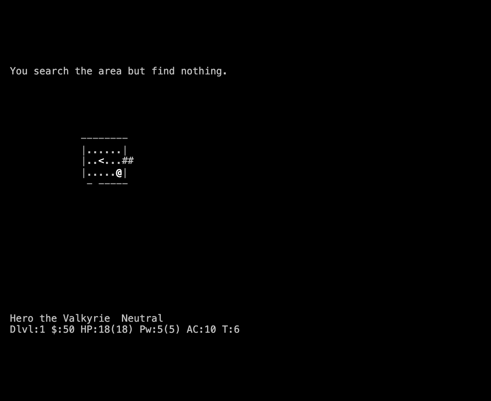
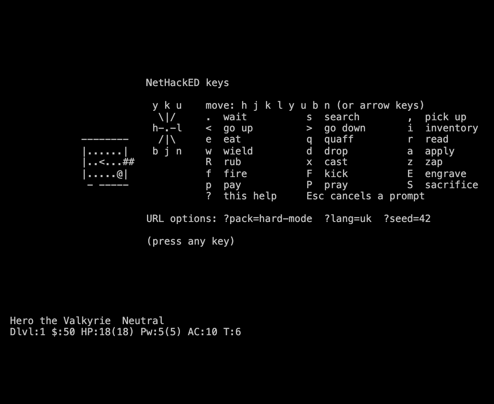
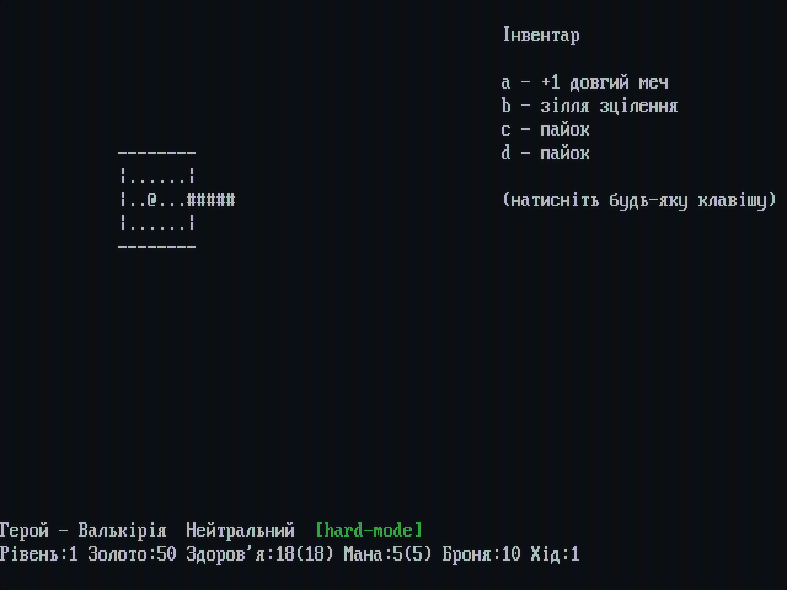
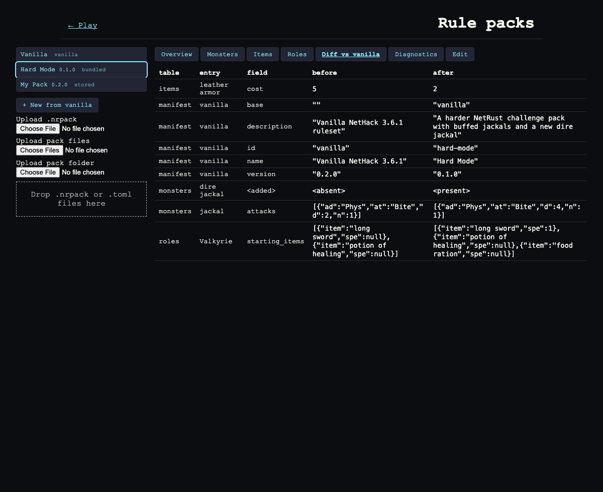
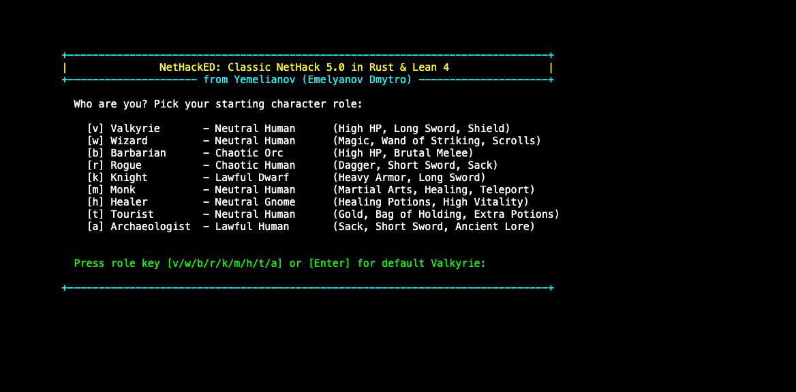
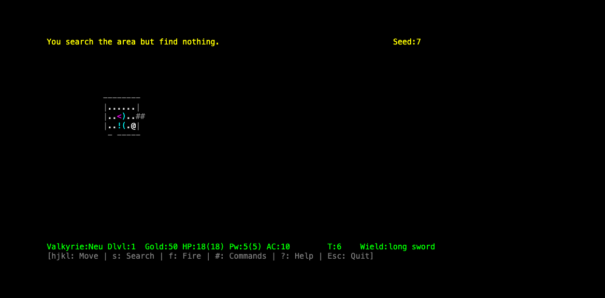

# Playing NetHackED: Browser, Terminal and SSH

NetHackED can be played in four places. All of them run the same deterministic engine, so a given seed, ruleset and sequence of keys produces the same game everywhere.

| Where | What you get | How |
|---|---|---|
| [nethacked.yemelianov.dev](https://nethacked.yemelianov.dev/) | A clean 80×24 keyboard-only terminal in the browser | Open the link |
| [GitHub Pages](https://dmytro-yemelianov.github.io/NetHackED/) | The developer web client: tile canvas, AI arena, benchmark tables, rule pack manager | Open the link |
| Your terminal | The native TUI (`nethacked`) | `cargo install --path crates/nethacked-tui --locked` |
| Over SSH | The native TUI on a server | `ssh -t host nethacked`, or a dedicated `play` account |

---

## 1. In the browser: the clean terminal



The page at **nethacked.yemelianov.dev** is only a terminal. It draws with [pixel-ssh](https://github.com/dmytro-yemelianov/pixel-ssh), the engine behind [yemelianov.dev](https://yemelianov.dev/), so the look is the same:
- an 8-bit indexed framebuffer;
- IBM VGA, EGA and BIOS bitmap fonts, including Cyrillic;
- retro palettes;
- WebGL2 CRT effects.

Without WebGL2 the page falls back to a plain text terminal.



| Key | Display |
|---|---|
| `F2` | Display system: VGA 640×400, EGA 640×350, SGA 640×480 or SVGA 800×600 (the systems with at least 80 columns) |
| `F3` | Palette |
| `F4` | Visual effects: Default, Clean, CRT, Arcade, Bloom, Glitch |

The choice is remembered in the browser.



The rest of this page: It has no buttons and no panels. It looks like a NetHack screen:
- line 0 is the message line;
- lines 1–21 are the map;
- lines 22–23 are the two status lines.

The game itself is the Rust engine compiled to WebAssembly, so nothing runs on a server. Each browser tab is its own game.



### Keys

| Keys | Action |
|---|---|
| `h j k l y u b n`, arrow keys | Move (the diagonal letters are `y u b n`) |
| `.` | Wait a turn |
| `s` | Search |
| `,` | Pick up |
| `<` `>` | Go up or down stairs |
| `i` | Inventory |
| `e` `q` `r` `w` `d` `a` `R` `S` | Eat, quaff, read, wield, drop, apply, rub, sacrifice. You are prompted for an item letter: `What do you want to eat? [a-c or ?*]` |
| `x` `z` `f` `F` | Cast, zap, fire, kick. You are prompted for a direction |
| `E` | Engrave. Type the text and press Enter |
| `p` `P` | Pay, pray |
| `Ctrl+P` | Show the previous message (press again for older ones, last 20 lines) |
| `?` | Help |
| `Esc` | Cancel a prompt |

The messages of one turn share the top line while they fit; the rest follow after `--More--`. Press any key to see the next one, or Esc to skip the rest. The line clears when you press the next command key.



### URL options

| Option | Effect |
|---|---|
| `?pack=hard-mode` | Play on a bundled rule pack. Its id is shown in the status line |
| `?lang=uk` | Ukrainian: the page's own text (role menu, prompts, help, status labels) and the engine's messages and item names |
| `?seed=42` | A fixed seed, so the same keys replay the same game |

Options can be combined, for example `https://nethacked.yemelianov.dev/?pack=hard-mode&seed=7`.



---

## 2. In the browser: the developer client

The GitHub Pages site is the full web client. It adds:
- a tile canvas renderer;
- an AI arena that runs scripted and neural policies;
- tournament benchmark tables;
- the **rule pack manager** (`packs.html`).

The pack manager lists vanilla, the bundled packs and packs you upload. For each pack it shows:
- monsters, items and roles;
- validation diagnostics;
- a field-by-field diff against vanilla.

It also edits pack patches, either in a form or as raw TOML, and downloads the built `.nhpack`. See [Rule Packs](rule-packs.md) for the format.



Packs you upload stay in your browser, in IndexedDB. They are never sent anywhere.

---

## 3. In a terminal





```bash
cargo install --path crates/nethacked-tui --locked   # installs `nethacked` into ~/.cargo/bin
nethacked                      # pick a role, then play
nethacked --seed 7             # fixed seed
nethacked --pack hard-mode     # an installed rule pack (see `nethacked-pack install`)
nethacked --pack path/to/pack  # or a pack directory / .nhpack file
nethacked --uk                 # Ukrainian
```

The TUI needs a terminal of at least 80×24, and it redraws when the terminal is resized. The bottom line lists the main keys. `?` shows the rest, and `Esc` asks before quitting.

---

## 4. Over SSH

The TUI is an ordinary terminal program, so it works over SSH as long as SSH allocates a terminal.

### Your own server

```bash
ssh -t you@host nethacked
```

`-t` is required. Without it there is no pseudo-terminal, so raw mode fails and nothing is drawn.

### A public `ssh play@host` account

This setup works like nethack.alt.org. Create a dedicated account whose only command is the game:

```bash
sudo useradd -m -s /bin/sh play
sudo passwd -d play                      # passwordless; or set a published password
sudo install -m755 ~/.cargo/bin/nethacked /usr/local/bin/nethacked
```

Then add this to `/etc/ssh/sshd_config` and reload sshd (`sudo systemctl reload sshd`):

```
Match User play
    ForceCommand /usr/local/bin/nethacked
    PermitEmptyPasswords yes      # only if you chose passwordless play
    PermitTTY yes
    AllowTcpForwarding no
    AllowAgentForwarding no
    X11Forwarding no
    PermitTunnel no
```

Anyone can now play with `ssh play@host`. Each connection is a separate process with its own game.

Things to know:
- **There are no save files.** A dropped connection ends the game. If you want players to be able to reattach, start the game inside `tmux`: `ForceCommand tmux new -A -s game /usr/local/bin/nethacked`.
- **Rate-limit public access.** Use `MaxStartups` and `MaxSessions` in `sshd_config`, plus a tool such as `fail2ban`. Keep the `play` account free of a real shell and of anything secret.
- **Cloudflare cannot carry this SSH traffic by itself.** Workers and Containers accept only HTTP and WebSocket. Plain SSH through Cloudflare needs Spectrum, or Cloudflare Tunnel in front of a machine you run. That is why the Cloudflare site is the WebAssembly terminal described above.

---

## See also

- [Web and WebAssembly](web-and-wasm.md): how the browser builds work and how they are deployed.
- [Rule Packs](rule-packs.md): the pack format and the `nethacked-pack` CLI.
- [Architecture](architecture.md): how the engine is put together.
